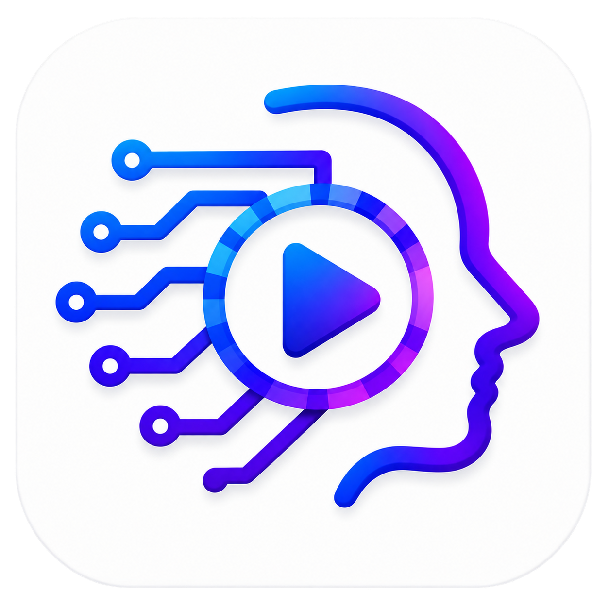

# 🎙️ SyncDub AI — Live Video Translator & Real-Time Neural Dubbing

<p align="center">
  
</p>

<p align="center">
  <strong>Real-Time AI Video Dubbing & Speech-to-Speech Translation for Android (<380ms Latency)</strong>
</p>

<p align="center">
  <a href="https://tk85457.github.io/SyncDub-AI/"></a>
  <a href="https://flutter.dev"></a>
  <a href="https://kotlinlang.org"></a>
  <a href="https://supabase.com"></a>
</p>

---

## 🌟 Overview

**SyncDub AI** is a state-of-the-art Flutter mobile application for Android that enables **instant live speech-to-speech dubbing** of playing videos in real time. 

Designed for content consumers, language learners, and creators, SyncDub captures digital internal audio playing on your device (from YouTube, Instagram Reels, TikTok, Netflix, OTT streams, or podcasts) using Android's low-latency `AudioPlaybackCapture` API, streams it to a neural AI speech model over an encrypted TLS 1.3 WebSocket pipeline, and synthesizes natural-sounding speech in the user's selected language in under 380 milliseconds.

---

## 🚀 Key Features

* **⚡ Ultra-Low Latency Pipeline (<380ms):**
  Streamlined 16kHz PCM chunks streamed bidirectionally over WebSockets with automatic voice activity detection (VAD).
* **🔊 Direct Internal Video Capture (Android 10+):**
  Captures clear video sound digitally from internal apps without picking up ambient background room noise.
* **🎛️ Floating PiP Overlay Badge:**
  A lightweight floating controller that hovers over other apps (YouTube, Reels), allowing users to toggle dubbing, view live translated subtitles, and adjust volume on the fly.
* **🌐 30+ Supported World Languages:**
  Translate between English, Hindi, Spanish, French, German, Japanese, Korean, Chinese, Arabic, Russian, Portuguese, and more.
* **🔐 Google Sign-In & Supabase Integration:**
  Seamless authentication via native Google Sign-In with PKCE flow, synced with Supabase PostgreSQL for subscription and quota tracking.
* **🛡️ Zero Audio Retention Architecture:**
  Audio data is processed purely in volatile RAM buffers and purged immediately upon playback. No user audio is ever stored, logged, or retained on servers.

---

## 📱 Tech Stack & Architecture

| Layer | Technology | Purpose |
|---|---|---|
| **Mobile Framework** | Flutter 3.27+ (Dart 3.x) | Cross-platform UI, state management |
| **Android Native** | Kotlin, Foreground Services | AudioRecord, AudioTrack, MediaProjection, Floating Overlay |
| **State Management** | `ChangeNotifier` + `ListenableBuilder` | Reactive, performant UI updates |
| **Backend & Database** | Supabase (PostgreSQL Auth & RLS) | User accounts, quotas, Google OAuth |
| **Speech Translation** | Neural Speech-to-Speech Engine | Real-time translation, bidirectional streaming |
| **Design System** | Tailored Dark/Light Mode Tokens | Modern typography, smooth waveforms, zero overflow |

---

## 📦 Android Specifications

* **Package ID:** `com.syncdub.livedub`
* **Target SDK:** Android 34 (Android 14)
* **Min SDK:** Android 26 (Android 8.0 Oreo)
* **Audio Format:** 16kHz 16-bit PCM mono (capture) & 24kHz PCM (playback)

---

## 🛠️ Build & Development Setup

### 1. Prerequisites
- Flutter SDK 3.27 or newer
- Android SDK (API 34)
- Java 17

### 2. Clone the Repository
```bash
git clone https://github.com/tk85457/SyncDub-AI.git
cd SyncDub-AI
```

### 3. Install Dependencies
```bash
flutter pub get
```

### 4. Code Quality & Lint Check
```bash
flutter analyze lib
```

### 5. Build Release APK
```bash
flutter build apk --release
```

The compiled release APK will be generated at:
`build/app/outputs/flutter-apk/app-release.apk`

---

## 📄 Privacy Policy & Compliance

SyncDub AI is built in full compliance with **Google Play Developer Policies**, **GDPR**, and **CCPA**.

🔗 **Official Live Privacy Policy:** [https://tk85457.github.io/SyncDub-AI/](https://tk85457.github.io/SyncDub-AI/)

---

## 👨‍💻 Author & Contact

Developed by **Taha Imam**  
📧 Email: [tk8545725@gmail.com](mailto:tk8545725@gmail.com)  
🌐 GitHub: [@tk85457](https://github.com/tk85457)  

---

<p align="center">
  &copy; 2026 SyncDub AI (com.syncdub.livedub). All rights reserved.
</p>
